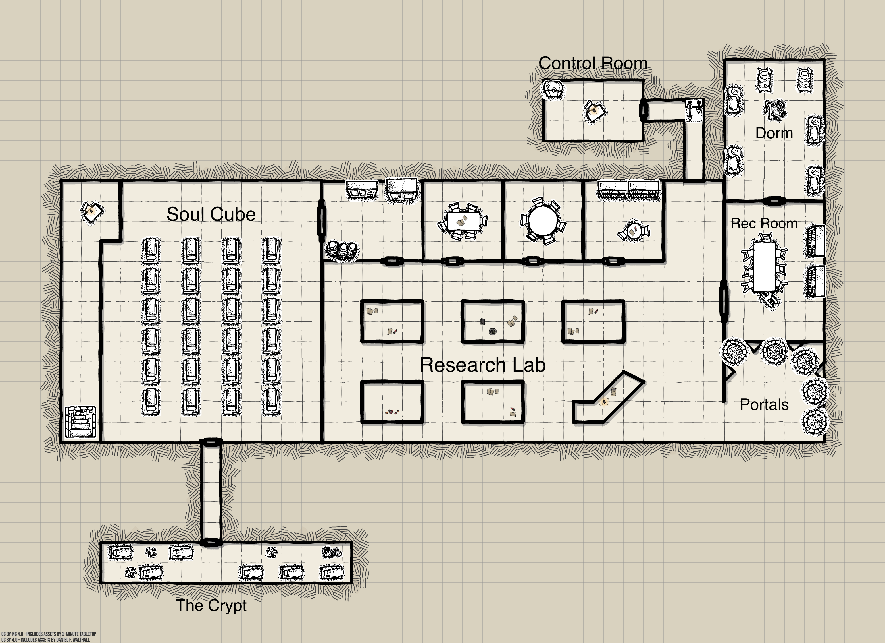
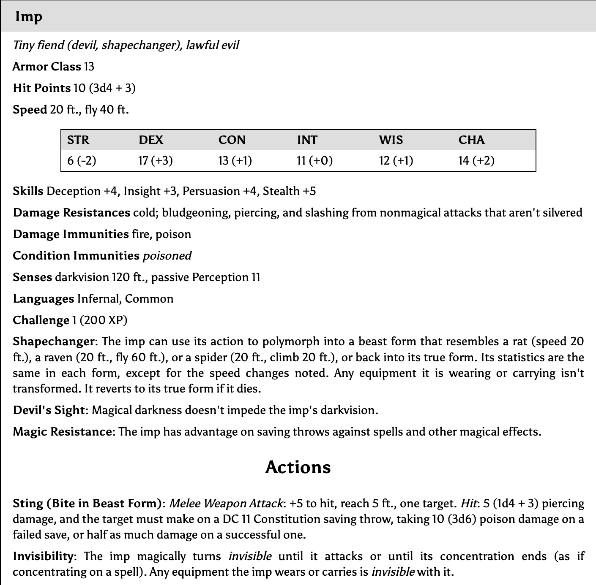
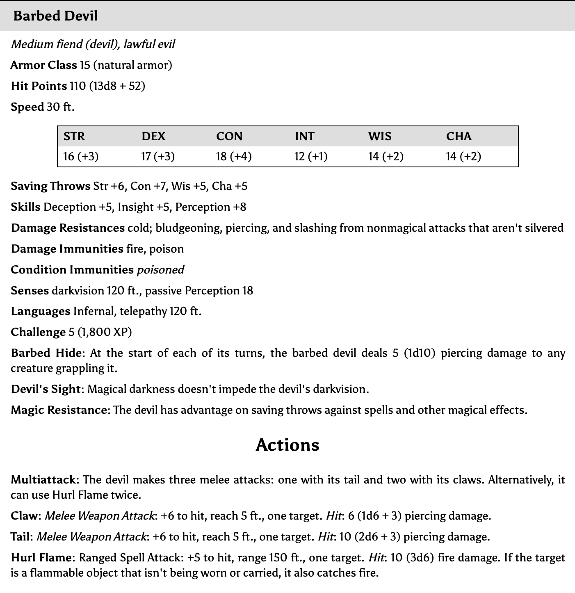
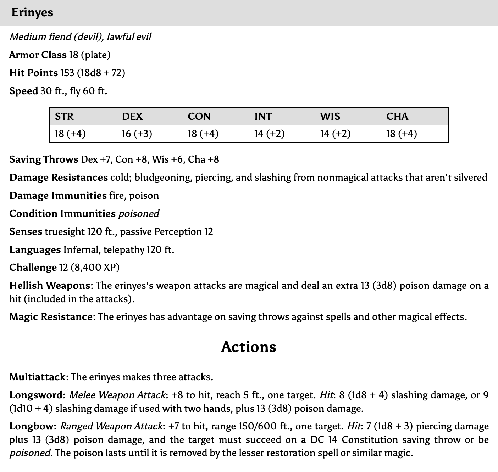

Return to the Architecture
==========================

* Game map file: `game-map`
* Dungeon Scrawler map file: `map.ds`
* [Monster Manual](https://donjon.bin.sh/5e/monsters/)
* [Spells](https://colinmarc.com/dndspells/)



Portal Room
-----------

Our intrepid adventures emerge from the portal, and find themselves in 25'x25' room. 

The walls, floor, and ceiling are all made from dark, almost black basalt stone; illuminated by the shimmering light of 5 other portals. Four of the portals cast a blue-white light, resembling deep pools of water illuminated from within. The fifth portal in the northwest corner, by contrast, is a bright and torrid orange. It's painful to look at and makes you uneasy.

If you approach any of the portals you feel a tingling static sensation that grows stronger the closer you get. Finally within one foot of the portal's churning surface you feel a force pushing you back – you can't enter any of them.

The portals are in "ingress only" mode. The players can't leave until they enable portal egress in the __control room__.

Research Lab
------------

A large, curved desk is the first thing you see rounding the corner from the portal room. It sits at the eastern end of a long open room containing two rows of tables covered in books, parchment, and quills.

A small imp (_orange triangle on the game map_) is sitting at the curved desk. He seems to be completely absorbed by a large  book in front of him, bound in bright red leather, in which he's scribbling notes.

If they chose to, the players could successfully sneak around the imp unnoticed (_DC of 14_), until they come within 10 feet of him.

If the players speak with the imp, he'll ask them to state their business – "you here to help with the liquidation?" He pulls the book closer to himself when they approach. He won't be easy to fool (_DC of 25_).

If the imp gets suspicious he'll reach for a button underneath the desk. The players can attempt to stop him with an initiative roll versus the imp. If they fail, a bell will ring, and the whole facility will be placed __on alert__. The barbed devils will immediately rush out the __rec room__ to attack the players.

If the players read the imp's book, they'll find it the following written:

```yaml
BLOODRIVER SOUL CAPITAL GROUP, SPECIAL PROJECT 𐤌𐤀‎

The partners at BSCG have identified this facility as an excellent source of prime mortal souls. If our calculations are correct, thousands of high-quality souls have been stored here.

Moreover, the facility appears to be abandoned. An efficient liquidation project could yield huge returns and allow us to meet or even exceed our quarterly KPIs. All subordinates and slaves must work double shifts on penalty of death.

This project is directed by Her Excellency Balmoleth, Lord of Gehenna, BSCG partner.

PORTAL INGRESS AND EGRESS

Portal no. 1 has been comandeered and re-routed to the Nine Hells for BSCG partners, subordinates, and slaves to travel to and from the site. We have detected no traffic on the other four portals.

Our usual incentives have not reduced absenteeism; as a result all portals have been placed in INGRESS ONLY MODE. No one can leave unless EGRESS MODE is enabled using the controls in the north control room.

SPECIAL ADVISORIES

Special care is to be observed in the chamber where souls are stored.

The soul chamber control panel, if misused, could cause serious problems. Above all DO NOT PUSH THE BIG RED BUTTON – we believe this will discharge all souls stored in the facility, returning them to their mortal bodies. Moreover some of those bodies appear to be stored nearby, posing an unacceptable

[the imp stopped writing here]
```

Control Room
------------

The control door door is hidden, the only evidence that there is a door at this wall is a small hole in the wall. This can only be opened using the __control room key__ hanging on Balmoleth's necklace. 

Once inside the hallway, a disembodied female voice echoing from the far wall will ask for a password – "Password, please." Players have 3 chances to guess the password; it's `manifer`. Three failed guesses will trigger a magic trap that fires a fireball down the hallway that detonates at the door (_12d6 damage, 1/2 damage with dexterity save of 22_). The nature of the trap can be determined with a successful intelligence/arcana check of 13. It can be disarmed using a dispel magic spell, DC of 16.

A large desk with a switchboard sits in the center of the control room. Players observe the following controls labelled in a neat, compact hand:

* Five arcane inscriptions of etched glowing light, each labeled Portal 1–5. The inscription for Portal 1 appears to have been tampered with – it has a more complicated pattern written in a different hand. An arcana check of 16 will clarify that these are portal sigil sequences, written using a magic stylus found on the desk.
* Beneath each portal inscription, a red button labeled "Emergency portal shutdown".
* Beneath each portal inscription, a dial labelled "portal mode" with three settings: ingress only, egress only, egress & ingress. It's currently set to "ingress only" for all portals.

There's a heavy book chained to the desk. It's titled "Sigil Sequences", and contains sequences for the following destinations:

* Oaks
* Port Land
* Sakro Mendhi
* Lucastown
* Carnivale

The players can attempt to overwrite a portal's sigil sequence, DC of 20.

A sturdy reinforced chest sits in the corner. It's locked. The lock can be picked with a DC of 22, and smashed open with a strength check of 27. Inside the chest:

* 2,048 gold pieces stacked neatly in a tightly fit wooden box.
* A perfect sphere of lapis lazuli about the size of a plum.
* A "Globe of Invulnerability" Scroll (identified with a arcana check of 12).
* A perfectly transparent crystal ring. Twisting the ring on your finger casts "Greater Invisibility" on the wearer, works once per day. Can be identified with an arcana check of 19.

Rec Room
--------

From just outside the door players can hear the sound of whipping, pained shrieks, and angry barks. Light is coming through a keyhole, and they can peer inside. Two barbed devils (_green triangles on the game map_) are whipping an imp tied to the table.

However if the facility is __on alert__, the barbed devils will have already rushed out of the room.

A badly bleeding imp is tied to the rec room table. He is terrified of the players. If players successfully calm the imp down (16 DC) he will tell them about Bloodriver Soul Capital Group, and what they're doing there. He knows about the portal control room, and the __control room key__ on Balmoleth's neck.

If players search the bookshelves in the room they will find a scroll tube containing:

* A "Passwall" scroll (ID with arcana check of 11)
* A "Rary's telepathic bond" scroll (ID with arcana check of 11)

Dorms
-----

Many dead bodies have been piled in here, including the bodies of people the players killed when they first raided the Architecture. It appears the agents of BSCG have dragged them here.

If they search the bodies they'll find:

* A beautifully polished +2 morningstar

Offices
-------

The offices have glass walls so players can see inside them. The two left-most offices have tables, chairs, and some parchment papers scattered on the desks. The right-most office has a bookshelf with a few interesting books inside, if the players take time to look. 

One book, labeled "Control Room Manual", is a highly technical manual on portal operation. On the first page however someone has written "password is manifer".

Another labeled "Local Body Inventory" contains a short list of names. One name the players notice is "Brimlad Pike, Halfling woman".

Decontainment Chamber
---------------------

Lockers line the north wall, and on the south wall dark obsidian cubes are stacked up to head height. The cubes are perforated with many tiny holes, like pumice. When players peer into the cubes, they detect a flickering orange light. The lockers, when opened, are also filled with these cubes.

Soul Cube
---------

This large, cube-shaped room is lined with rows and rows of sliding shelves, all containing receptacles for human souls.

Many imps are moving quickly up and down the rows. They each carry an obsidian cube with them. Using a strange metal tool, they hurriedly pull thin orange threads of light from the soul receptacles and into the cube.

The gangway to the west can be climbed using a single set of stairs. At the top overseeing the imps is a stunningly beautiful woman. Her skin glows radiantly, and she is dressed in dark plate armor. She has a sword at her hilt and carries a large black bow, almost as tall as she is. Most striking of all are the enormous wings on her back, covered in scarlet feathers. Despite her beauty her expression seems cold and cruel. This is __Balmoleth__!

How the devils react to the players depends on whether the facility is __on alert__: 

* If the facility is on alert, they will immediately attack the players as soon as they enter the room. The devils will have the initiative.

* If the facility is _not_ on alert, they'll be caught by surprise. Balmoleth will demand to know who they are and what they're doing there. This conversation won't go well, but the players will have the initiative if combat breaks out.

Once the players (hopefully) defeat Balmoleth and her minions, they'll find the __control room key__ hanging on her neck

At the top of the gangway, next to where Balmoleth first stood, is a control panel. Among many other confusing switches and levers, it has a big red button labeled "SOUL DUMP". If players push this button it will initiate the __soul dump sequence__:

* Countless streams of orange light will rush out of the shelves, flying out in all directions and passing throw the walls to unknown destinations.

* A few of them will rush through the door to the __crypt__. One of these souls belongs to Brimlad. She will come out of the crypt, dazed and confused, and meet the players.

Crypt
-----

A sign over this door reads "Local Body Storage". Inside players find a dark, cramp room lined with sarcophagi. Each is labeled with a name. One of them is clearly labeled "Brimlad Pike", and if players remove the lid, they'll recognize her body.

All of the bodies in the sarcophagi will be revived if the players initiate the __soul dump sequence__.

Monsters
--------





