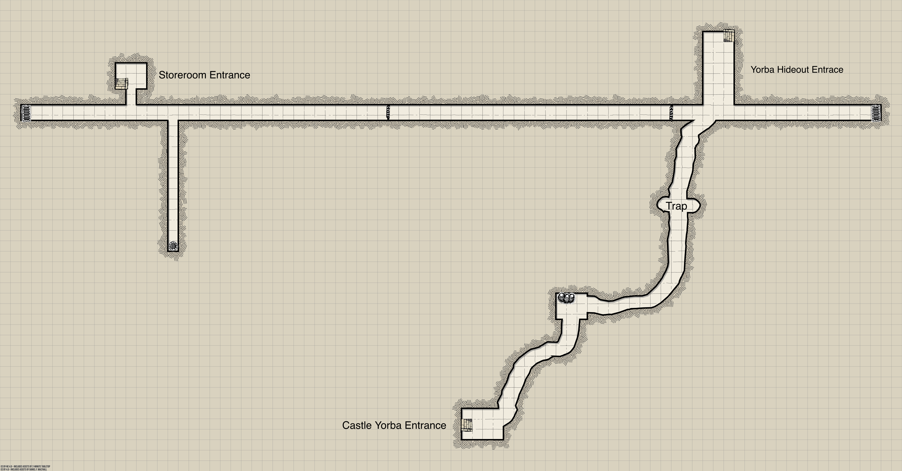
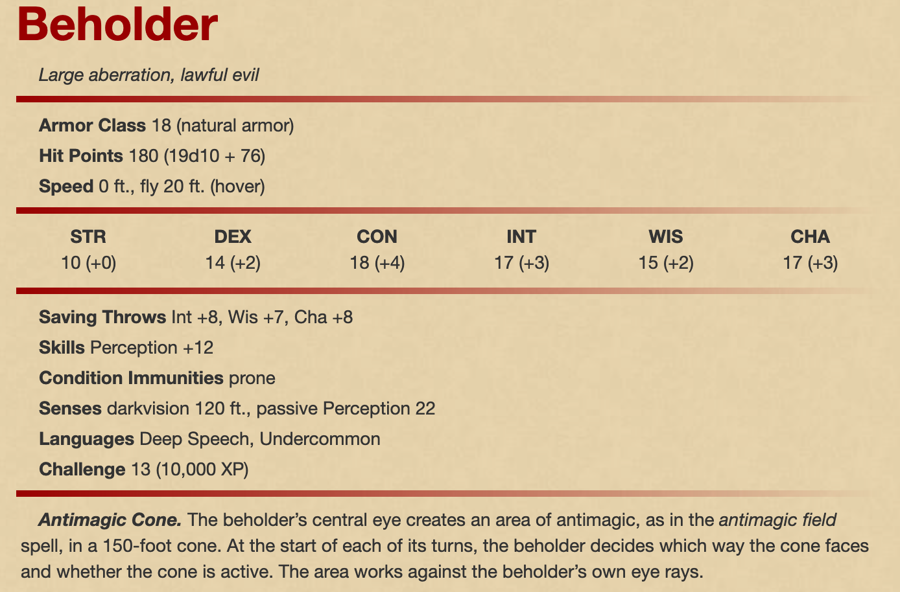
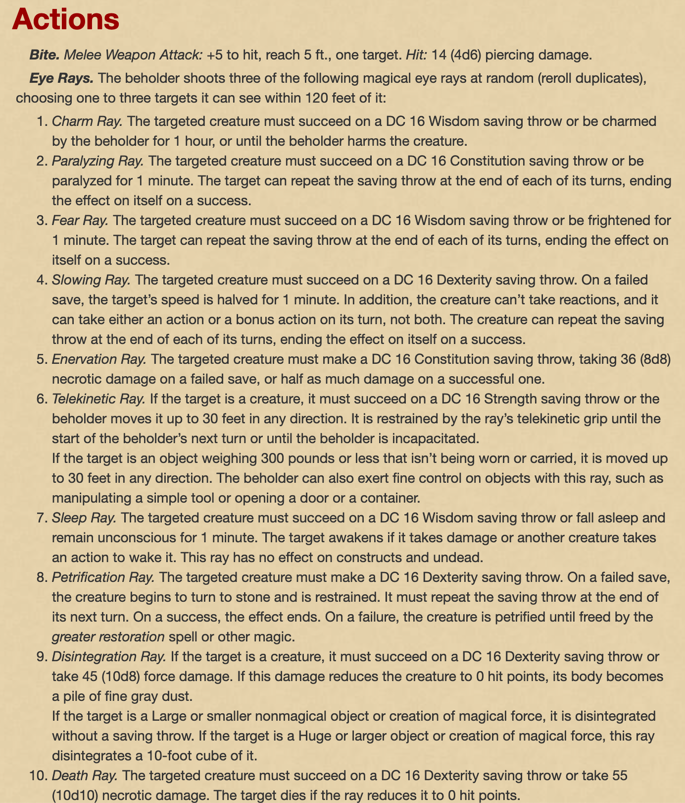
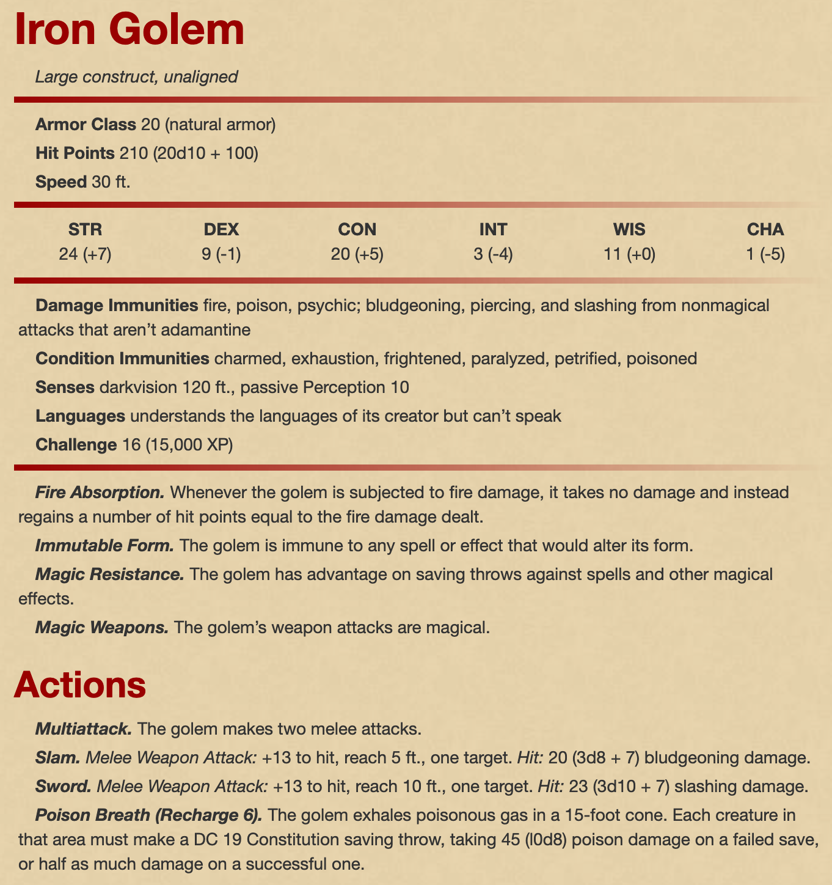

Castle Yorba Heist
==================

* Dungeon Scrawler map files: 
  * `street-map.ds`
  * `underground-map.pxd`
* Game map files:
  * `street-map.pxd`
  * `underground-map.pxd`
* [Dungeon Scrawler](https://probabletrain.itch.io/dungeon-scrawl)
* [Monster Manual](https://donjon.bin.sh/5e/monsters/)
  * [Another Manual](https://dnd-5e.herokuapp.com/monsters/)
* [Magic Items & Potions](https://donjon.bin.sh/5e/magic_items/)
* [Spells](https://colinmarc.com/dndspells/)

Streets of Carnivale
--------------------

Our players have been hooded for what feels like hours, unable to see anything. Eventually you hear the jingling of keys, the sound of a door opening, and a gruff voice orders you to stand up. You do with difficulty, as your hands are bound behind your backs.

You're lead down what sounds like a long echoing passageway. You almost stumble on some stairs, and you walk up into a brighter space. You flinch as someone steps behind you and unties your hands, and you're suddenly blinded as your hood is pulled off your head.

As your vision adjusts, you recognize the gnomish wizard who ambused you in the sewers. He's sitting at a modest wooden table, flanked by two imposing bodyguards.

"Thank you for taking the time to meet me," he says with a grin. "Seeing as we'll be working together, allow me to introduce myself – my name is Mercurio, and I manage a fraternal order of wizards. We're benevolent society, working to defend our interests, and you now work for us."

"I have a job that is uniquely suited for your talents.". Mercurio slides a parchment towards you. It looks like a street map, and he points at a block in the southeast corner of the map. "Three weeks ago a giant sphere materialized in the side of a building in downtown Carnivale. You might have heard some hub-bub about it. There's lots of speculating about what it might be, but my organization is confident that someone has warped a __planar sphere__ right in the middle of the prime material plane. We want that sphere, and you're going to get it for us."

"Here's where it gets tricky. That sphere is parked hundreds of feet up, and right in the middle of __Castle Yorba__. The Yorbans are a big important family here in Carnivale, and they're not letting anyone up to see it, at least not without paying some coin. So this little operation will require some tact. Any questions so far?"

He doesn't give you time to ask anything. "Good. Take this map, and take this too," he slides another piece of parchment, this one has a sequence of twelve runes written on it. "Your job is to get into that sphere, by any means necessary. The main stairwell inside Yorba castle should lead right up to it. Once you're inside the sphere, use this sigil sequence to warp to a rendezvous point. My people will be there to meet you."

Mercurio leans back in his chair, grinning. "Now get going." He has a self-satisfied look on his face that makes you want to punch him, or worse. But you can't – you feel resigned and defeated, and cannot summon the will to resist his orders. It's a crushing feeling, and you don't understand what's behind it.

### Restaurant

When you walk out of Mercurio's office you find yourself in a hot, smokey kitchen. A cook is chopping vegetables and doesn't even notice you. 

Walking out of the kitchen, you're surprised to find yourself in a restaurant. One patron nearby looks up, seems mildly suprised to see you, before returning to his meal. Out the  windows you see the hustle and bustle of a city street.

### The Streets

Commoners and horse carts travel up and down a cobble stone streets. It's a bright and sunny day and what you assume is Carnivale – some of you have been here before.

"Poppys! Poppys for sale!" A young elf boy (_orange square on map_) is hawking poppy flowers at the six-way intersection southwest of the restuarant. The players can ask him basic questions about the area – what merchants are nearby, and if he's heard any neighborhood gossip.

### Market

This shop has rows of tables covered in fruit, vegetables, fresh bread, sea food, and cured meats. A portly grocer is nearby organizing his wares.

The players can buy a variety of foods here, as well as beer and wine.

### Apothecary

An older woman is grinding something in a mortal and pestle, as mysterious liquids bubble and steam around here. "Come in, come in my dears," she says in a kind voice. "Potions, medicines, and herbs for all types, from housewives to wizards!"

The following items are for sale here:

* Potion of Greater Healing (4d4+4), 45 gold
* Potion of Superior Healing (8d4+8), 120 gold
* Potion of Speed (haste for 1 minute), 270 gold
* Cindar, 4 gold an ingot

### Wizardly Wares

A long, narrow room is lined with rows of bookshelves. There's barely enough space to squeeze past them. At the very back of the room, a dwarvish wizard in dingy robes is hunched over a book. He jolts up when you speak to him, and his spectacles fall of his face. "My goodness, sorry, very sorry, my mind was quite elsewhere. Are you looking for something in particular?"

The dwarf sells the following magical wares:

* Magical scrolls he happens to have transcribed
  * Glyph of Warding, 450 gold
  * Leomund's Tiny Hut, 430 gold
  * Dominate Person, 726 gold
  * Teleportation Circle, 1260 gold
* Various magical reagants, which the dwarf retrieves after rummaging in a back room.

### Armorer

A smartly dressed elvish man stands behind the counter. "Welcome to Meredith's Fine Armory. Are you looking for a particular piece?" The Elf caters primarily to wealthy collectors, but is excited to have clients who will actually wear his armors.

Almost any kind of armor or shield can be found here of ordinary quality. A few particularly fine pieces are also for sale:

* Masterwork Full Plate Armor, among the best made (18 AC + 2), 7400 gold pieces
* Mirror bright buckler, of elven craft (+1 to AC, 10% chance of deflecting spells and magical rays), 2400 gold
* Torque of Gundar, a solid gold torque (+2 to saves against all mind-affecting spells), 2000 gold

### The Tipsy Dragon

This tavern is in a beautiful, bright building with large windows looking out on the street. You're a bit shocked at the amount of glass. A fireplace crackles in the north corner, a few patrons are chatting and sipping drinks, and the barkeep is cleaning mugs behind the bar. A young man with blond hair and a rusty red cloak is sitting at the bar; he turns and looks at you when you come in.

When you approach the bar the young man is silent at first, but eventually he turns to whichever player is closest and addresses them by name. We flashes a small talisman as he speaks – it's a silver owl with ruby yes. His name is __Marek__.

"The guild has been looking for you – there's been a spectacular collapse of Nursey's cult in the past few days. Her undead followers have been returning to life, and her leadership has scattered. We suspect you might have been behind it, but wanted to confirm. Could you fill us in on the details?"

If the players inform Marek of the job Mercurio has sent them on, he'll grow very concerned. "The guild has been trying to gain access to the sphere for weeks. I'm not surprised the Magisters are also trying to get inside, but it's bad news." He explains to you that you can't get out of the job – if he's using his typical _modus operandi_, Mercurio has put you all under a __geas__, and you cannot resist his commands while the spell is in effect.

"I need to talk to the center about this and figure out what we can do. Meet me at the __Rose Inn__ in one hour; I'll be in the room at the end of the hall."

### Lucas Bank

TODO

### Sisterhood of Thieves

TODO

### Malden Residence

TODO

### Castle Yorba

TODO

Underground
-----------

This is a small network of sewers and tunnels below street level. It's accessible at three different entrances.

### Storeroom Entrance

Leads to the storeroom next to the Wizardly Wares shop.

The sewerway here is blocked by grates to the east.

### Yorba Hideout Entrance

Leads to the Yorba hideout at street level.

### Castle Yorba Entrance

Leads to the northeast room inside Castle Yorba at street level.

Monsters
--------

