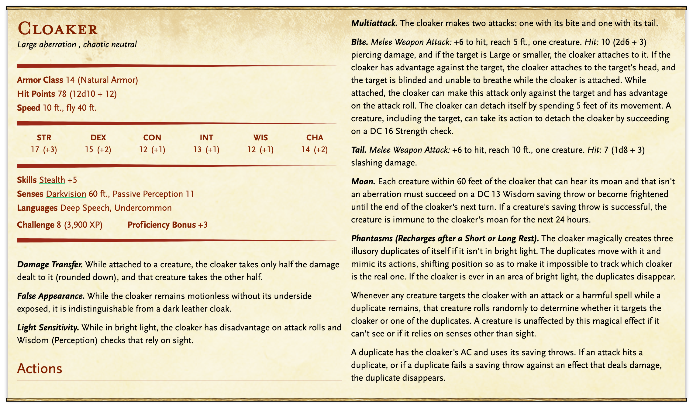
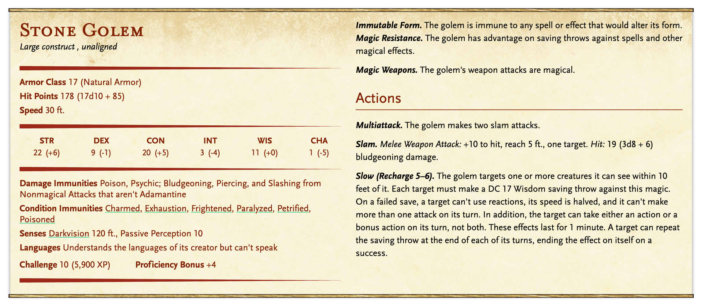
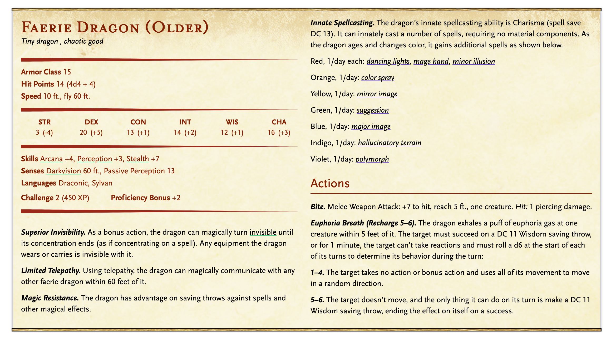

The Planar Sphere
=================

* Dungeon scrawler map file: `map.ds`
* Game map: `game-map.pxd`
* [Dungeon Scrawler](https://probabletrain.itch.io/dungeon-scrawl)
* [Monster Manual](https://www.dndbeyond.com/monsters)
* [Magic Items & Potions](https://donjon.bin.sh/5e/magic_items/)
* [Spells](https://www.dndbeyond.com/spells)

You have successfully infiltrated Castle Yorba and quickly ascend its endless flights of stairs, searching for the sphere. While you had been warned of the castle's heavy security, it seems most of those defenses were concentrated on the ground floor. You easily slip past the occasional servant you encounter in the stairwell. They're not on guard.

Normally in moments like these, with adventure afoot and everything going to plan, you would feel elated. But instead you feel anxious and worried, like a weight is pressing upon you. If things go bad, you know you won't be able to back out. You are powerless to resist Mercurio's command.

Suddenly you stop; something has caught Moroni's eye, and she signals you.

Barricades
----------

The stairwell has opened upon to cavernous hall, but nearly half of the space has been consumed by a massive, bronze-colored sphere. Judging by the sphere's curve, just a small section of its surface is exposed here; the rest of it is projecting outside of the castle walls. Despite its size, it is appears to float weightlessly in space, embedded in the castle like ball dropped in mud.

A small group of Yorban soldiers are clustered around the sphere, standing behind makeshift stone barricades. The room is so big that a crane has been placed here, presumably to build the stone walls. The soldiers are pointing wall guns at a small door on the face of the sphere. It's 12 feet off the ground, and a ladder has been propped in front of it.

Two men stand at a table to the east of the barricade, pointing at some diagrams and strategizing. One of these men is quite imposing, in full plate armor with gold trim, and a purple cape. His head is completely bald and his face is covered in scars.

If you speak with him, he'll ask who sent you here. He doesn't have time to spare. If asked, he'll identify himself as __Casimir Systema__, "servant of Lord Yorba". He won't be particularly suspicious of the players – after all, they wouldn't be in the castle if they weren't supposed to be – but he won't let them in the sphere without a good reason.

If asked – and if it seems like he has a good reason to tell these strangers – Casimir well tell you that he's already sent two squadrons into the sphere, and neither have returned. "The sphere's bloody dangerous, and it's shoved right up this castle's ass".

A dotty old wizard is standing to the west of the barricades, right at the sphere's edge. He's holding a small wand, and waving it over the sphere's surface. He's distracted, but will he'll tell you his name is __Seth__. "I'm analyzing this incredible machine".

If the players draw Seth out more, he'll explain he's been hired by the Yorbans to learn more about the sphere. It's a planar sphere, for sure, and based on his surface analysis it's been hopping from plane to plane for a long time. But it's so well-warded that he can't see anything inside.

Seth is a member of the Mage's Guild. If the players show him their silver owl and explain their situation, he'll convince Casimir to let them inside the sphere.

Sphere Entrance
---------------

The inside of the sphere is well light with a soft, warm light, though some sections of the hallway are dark, as if the magical source of this light has been extinguished. 

The walls seem to be made of lustrous bronze, with interesting ribbed supports and architectural flourishes. A walkway leads to hexagon-shaped room. There are circle-shaped doors to the north, southeast, and southwest. A long open hallway curves off to the northwest.

The floor is decorated with an intricate mosaic depicting spheres within spheres. More knowledgeable players will recognize it as a representation of the planar cosmology. 

Viewing Room
------------

The first thing you see upon entering the room is a small closet and cloaks hanging on hooks. The closet is full of various staffs, umbrellas, and shoes. They're all covered in a layer of dust.

A round table with a mirrory surface is at the center of the room. As you gaze at the surface, you see what at first looks like a map, but its incredibly detailed. Clouds drift above the landscape in three dimensions, and you can see the lapping of waves on the water. You recognize this as Carnivale, but seen from very high up, as a bird would see it.

Runes
-----

This room glows with the multi-colored light cast by runes carved in the floor.  None of you can fathom what they mean.

Golem Workshop
--------------

The first thing you notice here is the smell, and as you round the corner to this room you see the floor and walls are covered with streaks of blood. The lifeless bodies of a dozen men, all wearing the purple livery of Yorba, are crumpled around the room. Some have been crushed into the ground, and others appear to have been smashed against the wall.

Most striking of all is a towering stone figure standing at the back of the room. Its clenched fists are stained with blood. But it is motionless, and seemingly lifeless, like a statue.

The __Stone Golem__ will remain lifeless, unless __Melip__ decides to wake it. Melip has the power to command the Golem, and will use it to defend himself.

Laboratory
----------

Magical instruments, artifacts, and scrolls are neatly organized on long tables. The enormous horned skull of some unknown creature sits in the center of the room. Everything is covered in a thick layer of dust. A notebook by the skull is filled with tabular data written in a neat hand. None of it means anything to you, but you note that it's dated to the year 3045 – that's 116 years ago.

The bookshelf at the back of the room contains more notebooks, some filled with more tabular data, and others with detailed information about plants, animals, and other creatures most of you have never heard of before. Those who can pass an arcane knowledge check of 15 will recognize some of these creatures as extra-planar – they're not from our plane of existence.

Greenhouse
----------

The space is divided by curved walls of transluscent glass. It is as bright as day though there is no sun, nor any obvious light source. You feel a breeze on your skin, and hear the rustle of leaves. Trees and dense shrubs and growing here, and a deep spring of clear water feeds a stream that winds its way through a passageway ahead of you.

The south third of this space contains crates and barrels, most of them are completely empty, but a few have been filled with various insects. What seems to have once been a kitchen table has been carved up scratch marks, abstract drawings, and writing in a script most of you don't recognize. A player who rolls a knowledge check of 22 will identify this writing as Grung, but they can't read it unless they speak Grung.

The north third of this space contains a few small rows of crops. They're irrigated by the stream flowing from the next room. They're growing hot peppers, onions, and something that resembles a bright orange eggplant.

The western third of this space is the biggest, and three tall trees with dense leaves grow here. The stream bubbles gently by your feet. To the west you see 3 small thatched huts, only as tall as your waist, but there's no one in them.

When the players approach the huts they will be ambushed by 6 __Grung__ hiding in the trees.

* Grung Warrior
  * AC 12
  * HP 11
  * STR -2, DEX +2, CON +2, INT 0, WIS 0, CHA 0
  * Attacks: 
    * Blowgun, 1d4 damage + 3d8 poison damage the next round, a CON check of 17 halves the damage.
    * Short sword, 1d4 damage + 3d8 poison damage the next round, a CON check of 17 halves the damage.e

Library
-------

Unlike the cold metal walls of the rest of the sphere, this room is paneled with wood and illuminated by firelight. An abandoned chess board sits in front of a fireplace at the north end of the room. 

To the south, the bookshelfs are so densely packed that books and scrolls are falling all over the floor. 

As you round the corner of one of the bookshelves, you startle a small creature that lets out a little yelp, but it doesn't seem too bothered. It's a tiny dragon about the size of a cat, with iridescent purple scales and wings like a butterfly. 

"Hello guests, my name is Melip, a servant of the master." As he speaks, he shuffles books randomly from one part of the bookshelf to the other, with no obvious organizational scheme.

Melip will explain that he "serves the master," but he never gives him a name. When asked where the master is, he say he's "probably upstairs. Though I haven't seen him in time..." He stares into space as he says this, losing the thread of conversation. Melip frequently loses his concentration and seems dazed if he's pressed to hard in conversation.

If asked about the __Stone Golem__, Melip will call refer to him as his protector. Repeated questions about the Golem will make Melip suspicious and a little more lucid. If the players become aggressive, Melip will fly away to awaken the Golem, and it will defend him.

Study
-----

This appears to be a small study. Parchment litters the floor and a decidedly untidy desk is covered in dust. If players search the bookshelf, they will find:

* A "Flesh to Stone" spell scroll.
* A small box containing an _amulet of protection_. When worn, it increases your AC by 1.

If players search the desk, they'll find someone's personal notes, in the same hand as the notes they found in the __Laboratory__. They'll also find a __diagram__ that looks interesting (see the file `diagram.png`).

Foundry
-------

Two rows of five metal columns line this room. Bright flashes of lighting bolt from the top of one column to the next, and the air smells of ozone.

Each column has a lever, labeled "on" and "off". Nine of the levers are switched to "on", one is switched "off". The __diagram__ found in the study will reveal that this is the power switch for the "Bridge to Elevator". If the players flip this switch on, it will activate a __force-field bridge__ between the __warp bridge__ and the door to the __elevator__.

If the players flip the switch labeled  "defense bolts" on the __diagram__, it will disable the __defense bolts__ that block access to the __warp bridge__.

The Warp Bridge
---------------

The hallways leading to this room are defended by __defense bolts__ on both the north and south sides. On the south side, you find a scorched skeleton lying between the bolts. A passive perception check of 10 will make it obvious that this is some kind of trap. If a player walks into the bolts, a powerful bolt of energy will fire, dealing 12d8 electric damage. The defense bolts cannot be disabled by hand, they can only be turned off using the correct switch in the __foundry__.

Once you make it inside, you're amazed by what you see – a long thin bridge is suspended over infinite space. The space below the bridge is a sea of swirling color and mist, extended limitlessly below you. If a player falls into this space, they will simply float, unable to move unless they have some surface to push against or something pulling them.

Shortly after you enter the room, two shapes detach from the ceiling and begin flying around the room. They resemble flying mata rays; they are __cloakers__, and will attack the players.

A door to the __elevator__ is on the east side of this room, but it can't be reached on foot unless players have neabled the __force-field bridge.__.

Elevator
--------

At the end of this hall, a column of glittering light swirls up a round opening in the ceiling. If the players step inside the column, they will levitate up the column and to the next floor of the sphere, and the next adventure.

Monsters
--------

