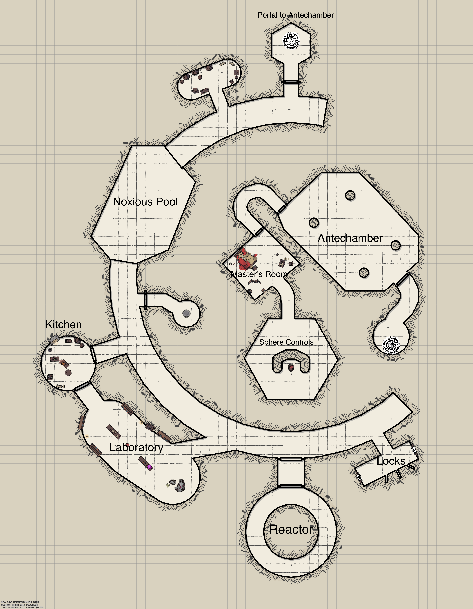

The Planar Sphere, Part 2
=========================

* Dungeon scrawler map file: `map.ds`
* Game map: `game-map.pxd`
* [Dungeon Scrawler](https://probabletrain.itch.io/dungeon-scrawl)
* [Monster Manual](https://www.dndbeyond.com/monsters)
* [Magic Items & Potions](https://donjon.bin.sh/5e/magic_items/)
* [Spells](https://www.dndbeyond.com/spells)



Hallways
--------

The second level of the sphere seem more forboding. The magical light source is much dimmer here, flickering in places and completely dark in others. The hallway curves around in both directions, providing a limited range of sight.

Noxious Pool
------------

The hallway opens up into a great pool of frothing, bright green liquid. A heavy gas is rising from the water's surface, and as you get closer it burns your nostrils and eyes. 

You see that the hallway continues on the other side of the pool, more than 50 feet away.

Anyone standing directly near the pool and breathing its gas must make a constitution roll (_DC 22_). If they fail the roll, they take 4d6 damage and are __poisoned__ (_disadvantage on attack and ability checks_) for 15 minutes.The players must reroll this check each time they entire the cloud of gas.

Kitchen
-------

You smell delicious food as soon as you entire this room. The smell of sweet meats, roast venison, and fresh fruit and vegetables invite you in, and each of you is certain to detect a whiff of your favorite food.

A welcoming fire burns in one side of the room, and a small fire elemental is tending to it. A water elemental stands nearby stirring a cast-iron pot.

An earth elemental stands behind a chopping block, and looks attentively at the players. They don't speak common, and when you try to make conversation, they only stare at you, occassionally responding in snippets of their own language, Primordial.

However, if the players name any food, the elementals will immediately prepare it for them. They can prepare any food or drink you ask for. Everything they prepare is incredibly delicious.

Laboratory
----------

The walls of this room are lined with bookshelves and two long workbenches are in the center of the room. The northmost table is covered in parchments, while various magical tools and instruments sit on the the southernmost table.

A small __stool__ made of walnut a red leather seat sits in the middle of a glowing runic circle. The following note, written in a tight, tidy hand, is on the table next to it:

```
Self-adjusting study stool
--------------------------

Mirtul 16th, 3045

Automatically floats up or down few inches to allow the occupant to sit comfortably and ergonomically at any desk. Manual control achieved using dial on leg.

TODO – double check your figures on this, might have used the wrong order of magnitude
```

Turning the dial on the stool will cause it to lift in the air, very rapidly and with great force. Only very fine control of the stool will prevent an occupant from hitting the ceiling. The stool is small and weighs only 5 pounds.

A bottle labeled __"Rune Effacer"__ sits on the same workbench by the stool. This liquid will erase any magical sigils or runes it is poured on.

If players search the cabinet along the north wall, they'll find a half dozen __masks__ arranged on hooks. The mask completely covers your face, with glass goggles over you eyes, and a long nose that you breathe through while wearing it. Wearing the mask will provide advantage on any constitution check against gases or other breathed-in effects.

Reactor
-------

The thick double doors to this room are locked, and can opened using one of the __lock levers__.

A thirty-foot wide black sphere hovers above the ground. It is featureless, perfectly smooth, and reflective. Though the reflection is otherwise clear, when you look closely at your own reflection, your face is a unrecognizable blur. Your skin tingles, and you hear a high-pitched ring in your ears.

For every minute spent in this room, the players must make a constitution check (_DC 25_) or suffer 1d4 radiation damage.

Locks
-----

A glowing orange floor carving cuts across the entrace to this room, its light shining through a stone floor otherwise blackened with ash.

If a player steps on or over the ward, three jets of fire will shoot from the opposite wall, converging on point above the ward and dealing 8d6 fire damage. If the player passes a dexterity check (_DC 16_) they take half damage. A trap sense check or arcane knowledge check (_DC 10_) will make it obvious that this is a trap. It can only be disarmed by erasing or otherwise damaging the magical ward, but touching the ward directly will trigger it.

There are two __lock levers__ on either side of the room. The lever to the east unlocks the __reactor__. The lever to the west unlocks the __portal to the antechamber__.

Storage Room
------------

TODO

Portal to Antechamber
---------------------

TODO

Antechamber
-----------

TODO

Master's Room
-------------

TODO

Sphere Controls
---------------

TODO