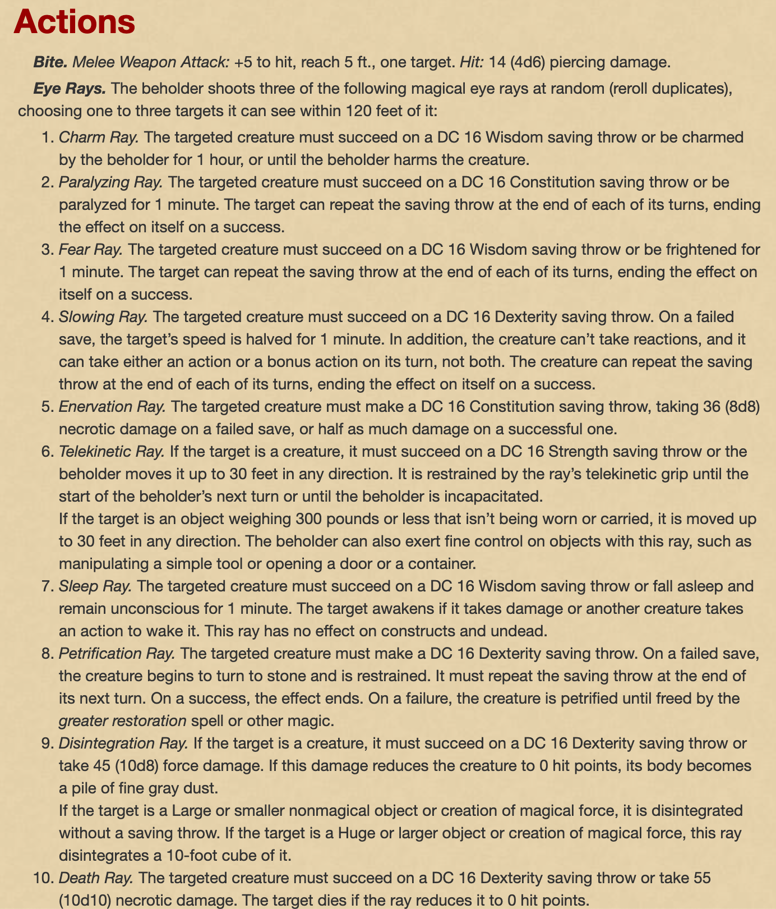

The Planar Sphere, Part 2
=========================

* Dungeon scrawler map file: `map.ds`
* Game map: `game-map.pxd`
* [Dungeon Scrawler](https://probabletrain.itch.io/dungeon-scrawl)
* [Monster Manual](https://www.dndbeyond.com/monsters)
* [Magic Items & Potions](https://donjon.bin.sh/5e/magic_items/)
* [Spells](https://www.dndbeyond.com/spells)


Hallways
--------

The second level of the sphere seem more forboding. The magical light source is much dimmer here, flickering in places and completely dark in others. The hallway curves around in both directions, providing a limited range of sight.

Noxious Pool
------------

The hallway opens up into a great pool of frothing, bright green liquid. A heavy gas is rising from the water's surface, and as you get closer it burns your nostrils and eyes. 

You see that the hallway continues on the other side of the pool, more than 50 feet away.

Anyone standing directly near the pool and breathing its gas must make a constitution roll (_DC 22_). If they fail the roll, they take 4d6 damage and are __poisoned__ (_disadvantage on attack and ability checks_) for 15 minutes.The players must reroll this check each time they entire the cloud of gas.

Kitchen
-------

You smell delicious food as soon as you entire this room. The smell of sweet meats, roast venison, and fresh fruit and vegetables invite you in, and each of you is certain to detect a whiff of your favorite food.

A welcoming fire burns in one side of the room, and a small fire elemental is tending to it. A water elemental stands nearby stirring a cast-iron pot.

An earth elemental stands behind a chopping block, and looks attentively at the players. They don't speak common, and when you try to make conversation, they only stare at you, occassionally responding in snippets of their own language, Primordial.

However, if the players name any food, the elementals will immediately prepare it for them. They can prepare any food or drink you ask for. Everything they prepare is incredibly delicious.

Laboratory
----------

The walls of this room are lined with bookshelves and two long workbenches are in the center of the room. The northmost table is covered in parchments, while various magical tools and instruments sit on the the southernmost table.

A small __stool__ made of walnut a red leather seat sits in the middle of a glowing runic circle. The following note, written in a tight, tidy hand, is on the table next to it:

```
Self-adjusting study stool
--------------------------

Mirtul 16th, 3045

Automatically floats up or down few inches to allow the occupant to sit comfortably and ergonomically at any desk. Manual control achieved using dial on leg.

TODO – double check your figures on this, might have used the wrong order of magnitude
```

Turning the dial on the stool will cause it to lift in the air, very rapidly and with great force. Only very fine control of the stool will prevent an occupant from hitting the ceiling. The stool is small and weighs only 5 pounds.

A bottle labeled __"Rune Effacer"__ sits on the same workbench by the stool. This liquid will erase any magical sigils or runes it is poured on.

If players search the cabinet along the north wall, they'll find a half dozen __masks__ arranged on hooks. The mask completely covers your face, with glass goggles over you eyes, and a long nose that you breathe through while wearing it. Wearing the mask will provide advantage on any constitution check against gases or other breathed-in effects.

Reactor
-------

The thick double doors to this room are locked, and can opened using one of the __lock levers__.

A thirty-foot wide black sphere hovers above the ground. It is featureless, perfectly smooth, and reflective. Though the reflection is otherwise clear, when you look closely at your own reflection, your face is a unrecognizable blur. Your skin tingles, and you hear a high-pitched ring in your ears.

For every minute spent in this room, the players must make a constitution check (_DC 25_) or suffer 1d4 radiation damage.

Locks
-----

A glowing orange floor carving cuts across the entrace to this room, its light shining through a stone floor otherwise blackened with ash.

If a player steps on or over the ward, three jets of fire will shoot from the opposite wall, converging on point above the ward and dealing 8d6 fire damage. If the player passes a dexterity check (_DC 16_) they take half damage. A trap sense check or arcane knowledge check (_DC 10_) will make it obvious that this is a trap. It can only be disarmed by erasing or otherwise damaging the magical ward, but touching the ward directly will trigger it.

There are two __lock levers__ on either side of the room. The lever to the east unlocks the __reactor__. The lever to the west unlocks the __portal to the antechamber__.

Storage Room
------------

A trail of blood leads to the corner of this otherwise unremarkable storage room. A dying Yorban soldier is leaning against the wall.

The soldier was part of the first regiment sent in by __Casimir__. The brigade made it deep into the sphere, despite some casualties. But then..."the spider...the spider..." The soldier's voice trails off, his eyes staring at nothing, and he dies. 

Portal to Antechamber
---------------------

The door to this portal is locked and heavily reinforced. It can be opened by one of the levers in the __Locks__ room.

When you enter this room you recognize the blue, shimmering glow of a magical portal. This portal transports the players to the Antechamber.

Antechamber
-----------

A wide, curving passageway leads from the portal to a round door. There's a trail of blood along the floor. The door is opened by a switch to the right.

The door opens up to a cavernous room, 35 feet wide, 30 feet high, and extending back into darkness. Four thick stone columns support the ceiling.

Dozens of limp and broken bodies are scattered around the floor, many of them wear the purple livery of the Yorban family. They haven't been dead long. But there are other, older corpses in various states of decay, many of them recognizably humanoid, but others are the bodies of strange beasts and eldritch races in strange clothes you don't recognize. Some have been here so long that only their bleached bones remain.

You don't have long to study the scene. From the dark side of the room, you hear the clanging of metal feet on the floor, in a rhythmic, staccato pattern. From the shadows, you first see two long arching legs, then two more, and then there are eight – an enormous spider, 15 feet wide from one leg tip to the other, clatters toward you.

The __mechanical spider__ is made of metal, at the joints of its legs you see spinning differentials and gears, and the tips of its legs have been sharpened into bloody spear points. Hissing steam vents from the top of its abdomen, and an orange glow shines through gaps and seams around its head. A swivelling orb sits on a stalk on top of its head, it darts back and forth, studying each of you.

The mechanical spider will try to prevent the players from entering the __northeast door__. The northeast door has four door handles, one at each corner of the door, spaced 7 feet apart. All four doors must be turned at the same time to open the door. The mechanical spider is too big to fit through the door opening.

Master's Room
-------------

Musty, stale air rushes out of this room when you open the door. Parchments and old clothes are scattered on the floor, and as you step inside your footsteps kick up small clouds of dust.

A large, messy beds sits to your right, and someone is lying under the sheets. Their eyes are not closed, in fact they are black, empty sockets. It's a mummified corpse. The wisps of a white beard cling to its skeletal chin.

When players search the desk, they find a __manuscript__ at the top of a pile of parchment:

```
Mirtul 22nd, 3045
• Ask Melip to find my copy of "Advanced Pelinism"
• Find a doctor soon

Mirtul 23rc, 3045
• Fix faulty sphere controls – destination sigil and countdown timer both randomly selecting inputs. Lamport clock needs replacement? 
```

The __chest__ at the end of the bed is locked, and can be picked with a DC of 26, or smashed with a DC of 35. It contains:

* A shimmering, reflective magical robe. The robe has a 15% chance of reflecting any magical spell or beam.
* The __sphere control key__.

Sphere Controls
---------------

Unlike the brass construction of the rest of the sphere, this room is made of black obsidian rock. A glowing pentagon is etched into the floor, and a curving control panel sits in the middle of the room.

An arcane knowledge check of 15 will allow the players to read the control panel labels:

* __Countdown to Warp__. A timer, currently ticking down from 2 hours and 3 minutes. There's a button next to it labeled "STOP".
* __Location Sigil__. A 64-rune long sigil sequence.
* Destination Sigil__. A 64 rune long sigil sequence, but it is randomly changing sequence with each tick of the countdown timer. The timer has to be stopped to prevent the random changes.
* __Keyhole__. Inserting the __sphere control key__ will allow players to operate the controls.
* __Warp Lever__. A finely crafted, hefty lever labeled "WARP".

A heavy leather tome sits to the left. Inside the players will find sigil sequences to every known plane of existence.

Players will feel a helpless urge to input the sigil sequence provided to them by Mercurio. To conciously input a different sequence, a player must resist his __geas__ and take 5d10 psychic damage.

Monsters
--------

### Mechanical Spider

* __Armor Class__ 19
* __Hit Points__ 178
* __Speed__ 40 feet
* __STR__ 20 (+5), __DEX__ 9 (-1), __CON__ 20 (+5), __INT__ 4 (-4), __WIS__ 11 (+0)
* __Damage immunities__: fire, poison, psychic, non-magical attacks.
* __Condition immunities__: charmed, exhaustion, frightened, paralyzed, petrified, poisoned.
* __Immutable form__: immune to any spell or effect that would alter its form.
* __Magic resistance__: Advantage on all saving throughs against spells and other magical effects.
* __Climbing__: By stabbing its sword legs into walls, the spider can climb and cling to walls. It's too heavy to hang upside down.
* __Power Cell__: The spider has a glowing orange power cell inside its head. Players can attempt to attack the cell directly through gaps in the spider's construction, but only at close range and with disadvantage. A successful attack against the power cell will deal critical damage to the spider, slow its movement in half, and cut down its number of attacks to 1 per round.

#### Attacks

The mechanical spider can make 3 attacks per round, in any combination of sword or eye ray attack.

* __Sword legs__: +12 to hit, reach 10 feet, 3d10+7 damage.
* __Eye Ray__: shoots one of 10 different kinds of eye rays from the orb on top of its head. The ray can fire in any direction, but cannot angle below the spider within a 5 foot radius of the spider's abdomen

#### Spider's Eye Rays

