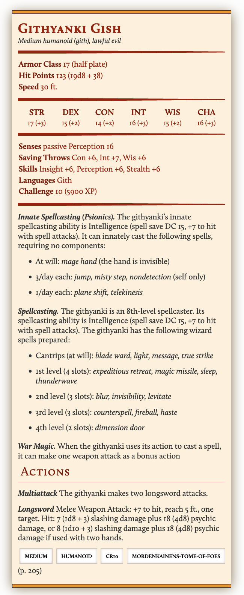
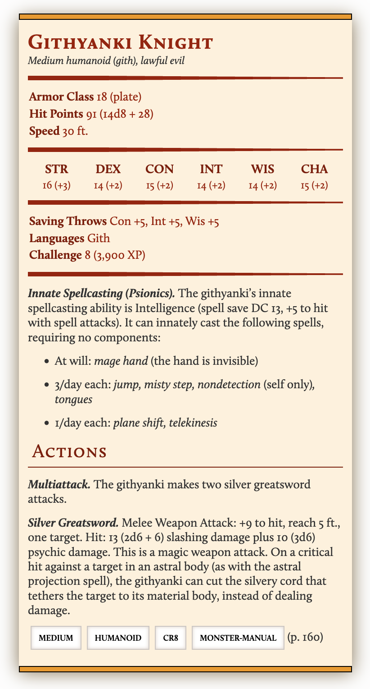

Sakro Mendhi
============

* Map: `map.ds`
* Game map: `map.pdx`
* Ambiance
  * [The City](https://rpg.ambient-mixer.com/medieval-town)
* [Dungeon Scrawler](https://probabletrain.itch.io/dungeon-scrawl)
* [Monster Manual](https://www.dndbeyond.com/monsters)
  * [Bestiary](https://dr-eigenvalue.github.io/bestiary/)
* [Magic Items & Potions](https://donjon.bin.sh/5e/magic_items/)
  * [Another Item Database](https://www.dndbeyond.com/magic-items)
* [Magic Item Generator](https://5emagic.shop/generate)
* [Spells](https://www.dndbeyond.com/spells)
* [Spellbook Generator](https://5emagic.shop/spellbook/generate)
* [NPC Generator](https://www.kassoon.com/dnd/npc-generator/)


With the pirate skiff captured, Jerimo nursed his wounds and guided your airship over the great desert surrounding Sakro Mendhi. Aided by a strong westerly wind, you arrive at Sakro Mendhi within half a day, landing at an airship dock on the eastern edge of the city. "I've registered your new airship with the harbormaster," Jerimo tells you, "she's in good hands and will be ready when you need her." Gundamar also bids you goodbye to continue his journey to JoSan, but not before giving Tilden a flagon of dwarvish fire wine.

You make your way through the bustling streets of Sakro Mendhi to the Temple of Flame. You know the entrace to the Mage Guild's hideout is nearby to the north, and this part of the city is also a good place to stock up on supplies. As you gather around a public fountain outside the temple, you take stock of what's changed since you were last in the city. Local Sakro Mendhans gather at the fountain to collect water and relax under the shade of plane trees. This is a merchant city, and trade seems to be as busy as ever. But you also see signs of a city on edge – you see more soldiers patrolling the streets than usual, and the barracks to your right seems to be on high alert.

The shout of a young boy rings out – "Papers for sale! Hot off the press! Papers for sale!" Sakro Mendhi is unique among bay cities for its vibrant culture of letters, and its use of wood block printing presses, which are rare in almost every other part of the known world. "War in the west!" the boy continues, "Read all about it! Lucastown is under attack!"

Players can purchase a copy of "The Lion's Mouth" for 2 copper coins. It reads:

```
Rising in the West – THE SPECTER OF WAR!

Couriers travelling from the west in the past few days report that Lucastown is under siege. A great army appeared overnight, and blockaded all land entrances to the city. A few merchants were able to escape by sea. 

The origin and demands of the army and its commanders are unknown. Witnesses report that the army marches under an orange banner defaced with a violet circle. Witnesses could not agree whether the soldiers were orcs, hobgoblins, or men. Stranger still, all witnesses agreed that the arrival of this army was preceded by the appearance of a golden ORB, the size of a large castle, floating in air outside Lucastown.

The LION'S MOUTH has requested an audience with the Sultan for comment on this evolving situation. His Excellency has not yet responded to our requests.
```

Temple of Flame
---------------

This neighborhood square is dominated by the Temple of Flame, one of the oldest buildings in Sakro Mendhi and the center of the Fire Cult, a minority religion in the deserts of the east since the Rakashan Empire last dominated this region centuries ago.

A Rakasha priest in bright yellow robes stands in prayer before a great flame in the center of the Temple. The temple is otherwise austere, with no furnishings of decoration of any kind, and only the light of the flame flickering on unadorned walls of black basalt.

If players interrupt the priest's prayer he will react with gentle amusement, and ask about them with genuine interest. If they ask about his religion, he will explain that this temple cultivates the flame that has since the beginning of time, the flame from which all creation was created and to which all creation will eventually return.

Barracks
--------

These barracks are home to a garrison of __Sakro Mendhan soldiers__. Although garrisoned, they seem to be at a state of alert, fully armed and dressed in their distinctive laminar armor. If the players intrude on the barracks, the garrison commander will ask them if they need help, or otherwise order them to leave.

If the players cause trouble in the neighborhood – for example, by starting a fight, or being caught in an act of robbery – the garrison will seek them out and arrest them. Once arrested, players will be imprisoned in the barracks. If players fight the soldiers, they will be criminals in Sakro Mendhi. They can escape the prison using the narrow __drain__ at its center, which connects with another drain in the streets to the northeast.

The Dreaming Bugbear
--------------------

A colorful illustration of a sleeping bugbear hangs on the outside of this tavern. A few locals sit at the bar, which is tended by an old dwarvish woman. You pause in surprise as you recognize the blond man in dusty red robes sitting by the fireplace – it's __Marek__, the Guild agent who told you to warp the Planar Sphere to Amegdul. He seems just as surprised to see you, and your arrival interrupts his conversation with a mustachioed gnome sitting to his left.

Marek beckons the players to his table. "Marley, Brimlad, everyone is here," he remarks, "I thought you were still in Amegdul with the sphere? Did you warp here?" He subtly reveals a small silver owl to you as you approach.

Marek will profess ignorance of the theft of the Sphere, "I left Amegdul early that evening, emergency guild business. I told the barkeep at the Dragon's Head Inn to inform you, did he not?" The mustachioed gnome eyes each of you with a grim expression as Marek speaks. Brimlad will notice that Marek is clutching a satchel nervously as he talks.

If the players accuse Marek of betrayal, he will react testily. "I'm not going to waste my time arguing with you, I have important business here and you should know better than to meddle in it." The dwarvish barkeep will intervene if things get noisy, and if a fight breaks out, she will ring a large handbell to summon __Sakro Mendhan soldiers__ from the nearby barracks. 

In combat, the mustachioed gnome will throw a powder into the flames of the nearby fireplace, which turn blue. He will stab Marek in the neck, jump into the flames, and teleport away.

If players somehow manage to get a hold of Marek's satchel, they will find the following:

* A silver owl with ruby eyes, resembling the old guild nonce.
* A letter on a small scrap of parchment that reads:

```
Leave Amegdul within four hours of sunset.

We will meet you at the Dreaming Bugbear in Sakro Mendhi within three days for debriefing and full payment.

Destroy this letter after you receive it.
```

### Marek

* Level 6 Sorcerer
* __HP__ 15
* __AC__ 9
* STR +1, DEX -1, CON -2, INT +0, WIS +1, CHA +1
* __Skills__ History +3, Religion +3
* __Attacks__ Melee +4 / 2d6+1 Short sword
* __Spells__: Cloud of Daggers, Blindness/Deafness, Blur, Color Spray, Burning Hands
* __Possessions__ 900 gp. Peridot (80 gp). Silver owl and letter (see above).

### Mustachioed gnome

He has a tattoo of a violet circle on the back of his neck.

* Level 6 Aristocrat
* __HP__ 51
* __AC__ 10
* STR -1, DEX -1, CON +4, INT +2, WIS +2, CHA +3
* __Skills__ Acrobatics +2, Medicine +5
* __Attacks__ +2 / 2d6-1 rapier
* __Possessions__ 200 gp.

Millie's Potions
----------------

A painted sign outside this building reads "Millie's Potions". Inside, lush green herbs grow alongside a wall of windows.

Millie is a cheerful, ruddy-faced woman in lighty canvas robes covered in hundreds of stains in every color imaginable. "Welcome, welcome! You look like the sort of folk in need of potions!"

For sale:

* Potion of Greater Healing (4d4+4), 150 gold
* Potion of Superior Healing (8d4+4), 450 gold
* Antitoxin (advantage on saving throws against poison for 1 hour), 50 gold
* Potion of Vitality (Cures Disease, Removes Poison), 960 gold

Scribe
------

A scrap of vellum is nailed to this door, and written in an equisitely fine and flourished hand, you read "Elemar, Scribe"

An old elvish man, quite scruffy looking for an elf, and completely hairless except for bushy white eyebrows, mumbles a greeting when you walk in. He doesn't even look up from his parchment.

For Sale: 

* Scroll of Blade Barrier, 2560 gold
* Scroll of Conjure Minor Elementals, 640 gold
* Scroll of Enervation, 1280 gold
* Scroll of Longstrider, 120 gold
* Scroll of Summon Greater Demon, 640 gold

Smith
-----

You hear the clanging of a blacksmith's hammer from the street. It's unbearably hot in here, and a burly dwarf with a braided red beard is sweating over his anvil. With a hiss of steam he plunges the hot metal in water, and pauses to show you his wares.

* Most ordinary weapons and armor
* +1 Breastplate (14 + Dex modifier (max 2) + 1), 1900 gold
* +1 Chain Shirt (13 + Dex modifier (max 2) + 1), 1500 gold

Fletcher
--------

A spectacled gnomish woman is carefully adjusting the tension on a crossbow when you enter. She removes her spectacles and smiles in greeting.

* Most ordinary ranged weapons
* Light Crossbow +1, 1800 gold
* Bolt +1, 300 gold for 12
* Arrow +1, 300 gold for 12

Skribane Grow Operation
-----------------------

A pale-skinned woman will answer to a knock on this door by opening a door hatch and only showing her face. Players will be rebuffed when knocking on this door unless Brimlad does the knocking – "is that you, Brimmie? Haven't seen you in Saktown for some time. Looking for tools of the trade?"

Two women are sitting at table in this dimly light room playing cards. Brimlad recognizes them as Mara (the pale-faced woman) and Melith (a halfling with braided white hair), two members of the sisterhood of thieves. You see a bright light shining from the room around the corner. "Nevermind that," Mara says with a grin. The room is full of potted Skribane, illuminated by bright magical lanterns.

Melith will offer to sell some "tools of the trade":

* Fine Thieves tools (+1 on all ability checks to disarm traps or open locks), 320 gold.

Commissary
----------

This room is filled with barrels, crates, and other stockpiled goods, presumably for trade. A portly man in workman's clothes is taking notes in a ledger at the back. "You here to collect any goods? We'll honor any commissary note issued within 50 leagues."

If Tilden presents his charter attesting that he is the __Lord of Plums__, he will collect 3,652 gold in plum profit.

Mage's Guild Entrance
---------------------

You recognize the entrance to the Mage's Guild hideout on the north side of the courtyard. A silver door knocker in the shape of a lion's paw sits at the center of the double doors. When you knock, you hear the whirring of a complicated locking mechanism, and the door opens itself, revealing a long carpeted hallway illuminated by candlelight.

The hallway opens up to hexagon-shaped room, with a complicated glowing sigil carved into the stone floor. As you step past the threshold, you hair stands on your neck as a shimmering force field closes behind you. You here a gentle chime, and a clear feminine voice rings out – "Identify yourselves and your purpose." In this moment, you feel slight chill on your scalp, as if a cold wind blew through the room, or some unseen energy passed through your skull.

The players must answer all questions truthfully, or they will be turned away. Once they identify themselves, the voice continues, "Please present your nonce." The player have no nonce, nor should they claim to, but should answer truthfully that their nonce was destroyed and they have come to collect a new one.

You hear the gentle chime again. "Thank you for your cooperation," the voice rings out again crisply. "The Red Wizard will meet you now." You feel your stomach fall through the floor and the room spin, and before you realize what's happening, you've teleported to another room, just outside the Red Wizard's chambers.

Meeting the Red Wizard
----------------------

You smell the familiar scent of incense as you entire the Red Wizard's inner sanctum, a round, sparsely furnished room with a wide window overlooking the domed palace of Sakro Mendhi. A cast-iron brazier, filled with hot embers and smoldering incense, dominates the center of the room. You see the Red Wizard, the same as ever in his bright red robes, leaning on a chair by the window and looking out at the cityscape. He smiles and beckons you as you enter the room. "Welcome, my friends. It's good to see your faces in this uncertain time." 

He reaches into voluminous sleeve and pulls out a small silver frog with emerald eyes. "This is the new nonce, it is secure for now and you can trust those who present it to you. Who would like to carry it?"

"I have questions for you my friends," the wizard continues, "but I imagine you may have many questions on your mind as well. Please, help me put your minds at ease. What can I tell you?"

After the players have finished their questions, the Red Wizard will ask his. He's keen to know what the players have been doing for the past few weeks. The guild knew that the players had been captured by the Fraternal Order of Magisters, and placed under a geas, and they sent an agent to assist them in Carnivale, but he disappeared and no news had been heard since. He is very disturbed to learn about Marek. "We knew that the old nonce had been compromised, but hadn't confirmed that a false nonce had been used in the field. The nonces are protected with powerful magic, and are exceedingly difficult to counterfeit. Your own nonce would have alerted you had it suspected the other nonce was fake."

"Someone very powerful is meddling in guild affairs, and now we hear reports of war in the west. I do not think it is a coincidence that the planar sphere was sighted near Lucastown either. Whoever our enemy is, they are two steps ahead of us, and I need your help catching up with them."

The wizard is suddenly interrupted by the sound of two powerful explosions that shake the entire building. The brazier topples over, scattering its embers across the floor. A siren begins to sound, and you hear shouting from the nearby hallway. The wizard rushes to his desk and grabs ring of heavy keys. "The enemy moves even faster than we think, we are under attack. I must hurry to secure the blast doors. Prepare to defend yourselves!" With suprising speed, the Red Wizard rushes out the door, and out of sight.

As you peer down the hallways outside the room, you hear the din of fierce combat coming from the south, punctuated by the boom of small explosions.

__Combat is ongoing in the mess hall to the south. For every three minutes that the player delay aiding the defenders in the mess, roll a d10 for each of the defenders in the mess, and subtract that roll from their total hit points.__

If the players return to this room once the assault has begun, they will find the __black monk__ looking through papers at the red wizard's desk.

Blast Door Control Room
-----------------------

Two __blast doors__ block further progress in this hideout – a door north, sealing off the __bulkhead__, and a door south, sealing off the __portal__.

The door to this room is heavily warded and can only be opened by keys carried by __Ara__.

Operations Rooms
----------------

The ___west room__ is filled arms, armor, potions, scrolls, and all the tools necessary for the overt and covert operation of the guild (or as the Grundler called it once, "rat fucking"). You could gather supplies here if you want.

Readily available to the players:

* A full suit of Plate Armor (AC 18, requires strength 15 to wear, disadvantage on stealth)
* Blowgun +1 (1 + 2 piercing damage, range 25/100)
  * 24 poison darts (2d8 poison damange, half damage with DC 15 Constitution saving throw)
* 4 Grenades (range 60 feet, each creature within 5 feet must succeed on a DC 12 dexterity saving throw or take 3d6 fire damage)

Found in the trapped chest (DC 17 to detect trap, DC 22 to disarm, deals 4d6 electric damage):

* Serpentine Owl. This serpentine statuette of an owl can become a [giant owl](https://www.dndbeyond.com/monsters/giant-owl) for up to 8 hours. Once it has been used, it can't be used again until 2 days have passed. The owl can telepathically communicate with you at any range if you and it are on the same plane of existence.

The __east room__ is confuses you at first, you see a random assortment of chests, doors that lead nowhere, climbing equipment, and traps. If you had to guess, this looks like training equipment.

Range
-----

This long room is made of polished obsidian, and a scorched dummy stands at the far end. It looks like it has been blasted repeatedly with magical energy. You see a wand and scroll sitting on a table nearby.

* This wand is made of carved ash, and tingles when you touch it. 6 charges of [Lightning Bolt](https://www.dndbeyond.com/spells/lightning-bolt).
* [Contingency](https://www.dndbeyond.com/spells/contingency) Scroll

Sanctum
-------

In contrast with the austere, practical rooms typical of the Guild, this room is quite beautiful. The ceiling is painted cobalt blue and decorated with stars. The stars cast a cool, blue light, illuminating a long table below.

A detailed map of the bay rests on the table, with statuettes in various colors placed in various positons around the map.

Someone has written meeting nobles on a fine piece of vellum:

```
Agenda for February 26th, 3161

* Siege of Lucastown
* Disappearance of the slayers of the Shackled Lord (Marley et al.)
* Unethical experiments by one Raimond of Oaks
* Revision of banned spelled list (re: "noodle penis")
```

There is a heavily warded door on the eastern side of the room. It is so heavily warded in multicolored sigils that you at first mistake it for a work of art instead of a door. There is a single keyhole at the center of the door. There is no hope of opening this door without the key.

Mess Hall
---------

You stumble upon a scene of furious havoc – what was once a mess hall has become a battleground. The smell of blood and sulfur is in the air, and the ground is already littered with the dead.

Two guild operatives are fighting for their lives. A human wizard in dusty pink robes, bleeding profusely from her right arm, is throwing crackling thunderbolts from her fingertips. A gnome in heavy plate armor is locked in combat with two foes, bravely trying to beat them back to a room to the south.

The attackers are not human, orc, or any other race you recognize. They are tall and slender humanoids with rough, leathery yellow skin and bright black eyes sunken deep in their orbits. They have long and angular skulls, with small and highly placed flat noses, and ears that are pointed and serrated in the back side. They wear heavy laminar armor, and each carry shimmering silver swords, wielded by both hands. One of these fiends is larger than the other two, and carries a triangular banner attached to a pole on the back of his armor. The banner is bright orange, and defaced with a violet circle. He points his sword at you, barking orders at the others in a strange, guttaral tongue.

__See details on the __friends__ and __foes__ in this battle in the sections below._

Portal
------

This room is behind a featureless metal door. It can only be opened using the lever in the __blast door control room__.

You recognize the cool blue light of a magical portal in this room, but it is flickering in and out – the surface of this portal appears to be unstable.

_If a player attempts to walk through the portal, they will distintegrate._

Bulkhead
--------

The way down this hallway is blocked by a large metal blast door. You hear the muffled sounds of combat on the other side of the door.

The blast door can only be opened using the lever in the __blast door control room__.

With the blast door open, the hallway opens up twenty feet to the right. Along the length of the right wall, a row of spears protrude from slots within the stone wall, and point at the wall directly opposite.

A partially dismantled blast door lies on the opposite side of this room – it appears to have been violently ripped open. 

You notice the sound first – deep, guttural breaths – and you realize there's something looming behind the broken blast door, and it's at least 15 feet tall. It takes a moment for your brain to piece together what you're seeing. Two orange eyes peer out at you from behind a huge six foot tall metal shield, with a violet circle painted on its center. But then you realize it's not a shield, it's a helmet sitting on an enormous head, and below that you see a maw of ravening teeth, each the size of your hand. This beast looks like a dragon, but it has no wings, and small, stunted arms. A heavy metal collar wraps around its neck.

Most importantly, it's staring directly at you, breathing heavily, but not moving past the threshold of the broken blast door. It seems to be waiting for your next move, or from some outside command.


Library
-------

TODO

The Breach
----------

TODO

Auditorium
----------

TODO

Safe Room
---------

TODO


Friends
--------

### Ara

Ara carries the key to the __blast door control room__.

* Female Human Wizard 10
* __HP__ 50
* __AC__ 10
* STR +4, DEX +0, CON +2, INT +2, WIS +2, CHA +1
* __Skills__  Intimidation +5, Medicine +6
* __Attacks__ Melee +8 / 1d+4 club hanging off her belt
* __Possessions__ Keys to blast door control room.
* __Spells__ [Magic Missile](https://www.dndbeyond.com/spells/magic-missile), [Fireball](https://www.dndbeyond.com/spells/fireball), [Blink](https://www.dndbeyond.com/spells/blink), [Confusion](https://www.dndbeyond.com/spells/confusion)

### Penthik

* Male Gnome Fighter 8
* __HP__ 79
* __AC__ 15
* STR +1, DEX +0, CON +2, INT +0, WIS +0, CHA +1
* __Skills__ Arcana +3, Persuasion +4
* __Attacks__ Melee +4 / 2d10+1 Warhammer

Foes
----





### The Black Monk

A human female in black Monk's robes. Her black hair has been shaved down to almost nothing, elaborate patterns are tattooed on her face in ochre ink.

* Level 12 monk
* __Ki Points__ 12
* __Hit Points__ 72
* __Armor Class__ 17
* __Speed__ 40 feet
* STR +2, DEX + 3, CON +2, INT +2, WIS +0, CHA +2
* __Skills__ Stealth +7
* __Attacks__ Two attacks per round.
  * Unarmed strike +6/3d6+2
  * Thrown darts +7/1d4+3. Darts are dipped in a sleeping potion. Roll 8d8, targets with hit points less than or equal to the roll fall asleep for 1 minute.
  * Grapple +4

__Blinding powder__ The monk has a pouch of powder that, when thrown in someone's face, stuns and amy even blind them. When thrown in a target's face, treat it as an attack against their touch AC. Struck targets must make a constitution check against DC 14, if theey succeed, they are stunned for one combat round. If they fail, they are stunned for one combat round but also blinded for an hour. The [cure blindness](https://dungeonsdragons.fandom.com/wiki/Cure_blindness) spell can reverse the effect.

__Stunning Fist__ A successful attack stuns a target for 1 round.

__Wholeness of Body__ As an action, you can regain hit points equal to three times your monk level. You must finish a long rest before you can use this feature again.

__Step of the Wind__ Spend 1 ki point, take [disengage](https://www.dndbeyond.com/sources/basic-rules/combat#Disengage) or [dash](https://www.dndbeyond.com/sources/basic-rules/combat#Dash) as a bonus action for your turn, jump distance is doubled.

